<div align="center">

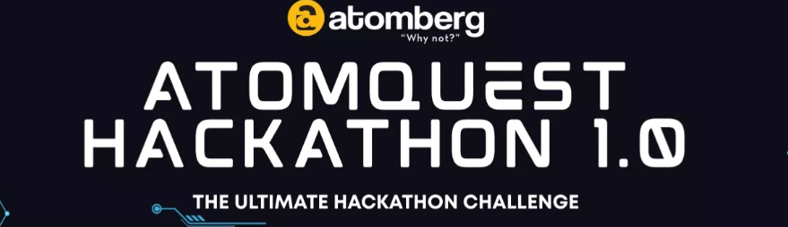

# GoalFlow

### Enterprise Goal Setting & Tracking Portal

**Submission for AtomQuest Hackathon 2026**

---

| | |
|---|---|
| **Candidate** | Gurjas Singh Gandhi |
| **College** | P.E.S's Modern College of Engineering, Pune |
| **Course / Year** | MCA, 2026 |
| **Live Application** | https://goal-flow-theta.vercel.app |
| **Source Code (GitHub)** | https://github.com/Gurjas2112/GoalFlow |
| **Submitted via** | Unstop — AtomQuest Hackathon 2026 |
| **Date** | May 19, 2026 |

</div>

---

## 📑 Index

- [GoalFlow](#goalflow)
    - [Enterprise Goal Setting \& Tracking Portal](#enterprise-goal-setting--tracking-portal)
  - [📑 Index](#-index)
  - [1. Executive Summary](#1-executive-summary)
  - [2. Problem Statement \& Objectives](#2-problem-statement--objectives)
  - [3. Solution Overview](#3-solution-overview)
  - [4. Live Deployment \& Repository](#4-live-deployment--repository)
  - [5. Demo Credentials](#5-demo-credentials)
  - [6. System Architecture](#6-system-architecture)
    - [6.1 Architecture Diagram (PlantUML)](#61-architecture-diagram-plantuml)
    - [6.2 Deployment Topology (PlantUML)](#62-deployment-topology-plantuml)
    - [6.3 Goal Sheet State Machine (PlantUML)](#63-goal-sheet-state-machine-plantuml)
    - [6.4 ER Diagram (PlantUML)](#64-er-diagram-plantuml)
    - [6.5 Approval Sequence (PlantUML)](#65-approval-sequence-plantuml)
  - [7. Technology Stack](#7-technology-stack)
  - [8. Core Feature Walkthrough](#8-core-feature-walkthrough)
    - [8.1 Employee](#81-employee)
    - [8.2 Manager](#82-manager)
    - [8.3 Admin / HR](#83-admin--hr)
  - [9. Application Screenshots](#9-application-screenshots)
    - [9.1 Admin — Dashboard](#91-admin--dashboard)
    - [9.2 Admin — Cycles (BRD-compliant Quarterlies)](#92-admin--cycles-brd-compliant-quarterlies)
    - [9.3 Admin — Escalations (Rules + Add-Rule Modal)](#93-admin--escalations-rules--add-rule-modal)
    - [9.4 Admin — Escalations List](#94-admin--escalations-list)
    - [9.5 Admin — User Management with Send-Password](#95-admin--user-management-with-send-password)
    - [9.6 Employee — Goals Page](#96-employee--goals-page)
  - [10. Scoring Engine — Formula Reference](#10-scoring-engine--formula-reference)
  - [11. Security, RBAC \& Audit](#11-security-rbac--audit)
  - [12. Integrations: Azure AD SSO, SMTP Email, Teams](#12-integrations-azure-ad-sso-smtp-email-teams)
  - [13. BRD Compliance Matrix](#13-brd-compliance-matrix)
  - [14. Local Setup \& Run Instructions](#14-local-setup--run-instructions)
  - [15. Future Roadmap](#15-future-roadmap)
  - [16. Conclusion](#16-conclusion)

---

## 1. Executive Summary

**GoalFlow** is a production-grade, role-based **Goal Setting & Tracking portal** purpose-built to digitise Atomberg's quarterly performance management cycle. It replaces fragmented spreadsheets with a single, audited, formula-driven system that operates the full lifecycle — **DRAFT → SUBMITTED → APPROVED → LOCKED → CHECK-IN → ACHIEVEMENT** — with strict cycle windows, post-lock audit, automated escalations and enterprise SSO.

Key highlights:
- 🎯 **End-to-end lifecycle** with 4 UoM formula engines (MIN / MAX / TIMELINE / ZERO-DEFECT)
- 🛡️ **Three-tier RBAC** (Employee / Manager / Admin) enforced both in middleware and UI
- 🔐 **Microsoft Entra ID SSO** with group → role auto-provisioning + local fallback
- 📧 **Nodemailer (SMTP) email + Teams webhooks** with 3-attempt retry and notification log
- ⚠️ **Escalation engine** — admin-configurable rules + hourly trigger job
- 📈 **Analytics dashboard** — QoQ trends, departmental heatmap, distribution charts
- 🧾 **Tamper-evident audit log** for every post-lock change
- ☁️ **Deployed in production** on Vercel (web) + Railway (API) + Supabase (Postgres, ap-south-1 Mumbai)

---

## 2. Problem Statement & Objectives

Atomberg's existing quarterly goal-setting process suffers from spreadsheet sprawl, inconsistent scoring, no audit trail and no automated nudges. The hackathon brief calls for a **secure, role-aware web portal** that:

1. Captures up to 8 goals per employee with thrust area, UoM, target and weightage (∑ = 100%).
2. Enforces an admin-controlled **goal-setting window** (configurable per quarter) plus an explicit override.
3. Implements **four scoring formulae** (MIN, MAX, TIMELINE, ZERO-DEFECT) with achievement-vs-target math.
4. Provides **manager review** (approve / return-with-reason), **quarterly check-ins** and **post-lock audit**.
5. Generates **reports & analytics** with CSV export.
6. Supports **SSO with Azure AD**, **email + Teams notifications**, and **escalations** for stalled sheets.

> **Submission requirement (from Unstop):** *"Ensure to submit only 1 document containing — working link, source code repository (GitHub / GitLab / Bitbucket) and architecture diagram."* — All three are included below.

---

## 3. Solution Overview

```
Employee  ──draft──▶  Manager  ──approve──▶  Locked Sheet  ──quarter end──▶  Check-in & Achievement
   ▲                     │                         │                                 │
   │                  return                       │                                 │
   └─────────────── (with reason) ◀────────────────┘                                 │
                                                                                     ▼
                                                                       Score auto-computed (4 UoM)
                                                                              │
                                                                              ▼
                                          Admin Dashboard ── Analytics ── Reports (CSV) ── Audit Log
                                                │                                 ▲
                                                ▼                                 │
                                       Escalation Engine ──hourly job──▶ Open Escalations
                                                │
                                                ▼
                                       Nodemailer SMTP + Teams Webhook
```

- **Single source of truth** — every state transition writes to `AuditLog`; nothing is mutable after `LOCKED` without a tracked change record.
- **Cycle-aware** — UI and API both gate writes by `GoalCycle.opens`/`closes` (with admin force-open override).
- **Idempotent seeding** — quarterly cycles (Q1–Q4 2026 & 2027), demo users and escalation rules are seeded by `prisma/seed.ts`.

---

## 4. Live Deployment & Repository

| Resource | URL |
|---|---|
| 🌐 **Live Demo** | https://goal-flow-theta.vercel.app |
| 💻 **GitHub Repository** | https://github.com/Gurjas2112/GoalFlow |
| 🔧 **API (Railway)** | Service `goalflow-api` (HTTPS, auto-deployed from `main`) |
| 🗄️ **Database** | Supabase Postgres — region `ap-south-1` (Mumbai) |

CI/CD: every push to `main` triggers Vercel (web) and Railway (API) auto-deploys. Prisma migrations run as part of the Railway start hook.

---

## 5. Demo Credentials

The login page exposes one-click "Quick Demo Access" buttons. Alternatively, sign in with:

| Role | Email | Password | Sheet State |
|------|-------|----------|-------------|
| Admin | `admin@goalflow.demo` | `Admin@123` | Full system access |
| Manager | `manager@goalflow.demo` | `Manager@123` | Team oversight |
| Sales Manager | `salesmgr@goalflow.demo` | `Manager@123` | Sales team |
| Employee 1 | `emp1@goalflow.demo` | `Emp@123` | LOCKED — check-in ready |
| Employee 2 | `emp2@goalflow.demo` | `Emp@123` | DRAFT — creation demo |
| Sales Employee | `sales1@goalflow.demo` | `Emp@123` | SUBMITTED — approval demo |

---

## 6. System Architecture

GoalFlow follows a **three-tier, serverless-friendly** architecture: a React SPA on Vercel, an Express REST API on Railway, and a managed PostgreSQL database on Supabase. Cross-cutting concerns (Auth, RBAC, Audit, Notifications, Escalation) are implemented as middleware / utility modules to keep route handlers thin.

### 6.1 Architecture Diagram (PlantUML)

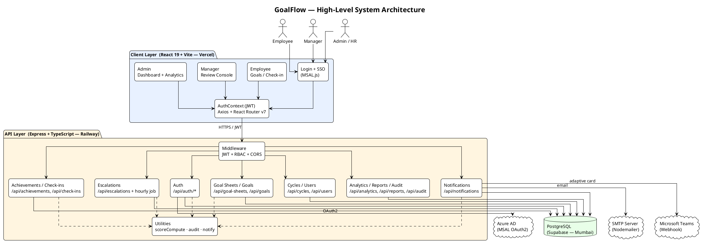

### 6.2 Deployment Topology (PlantUML)

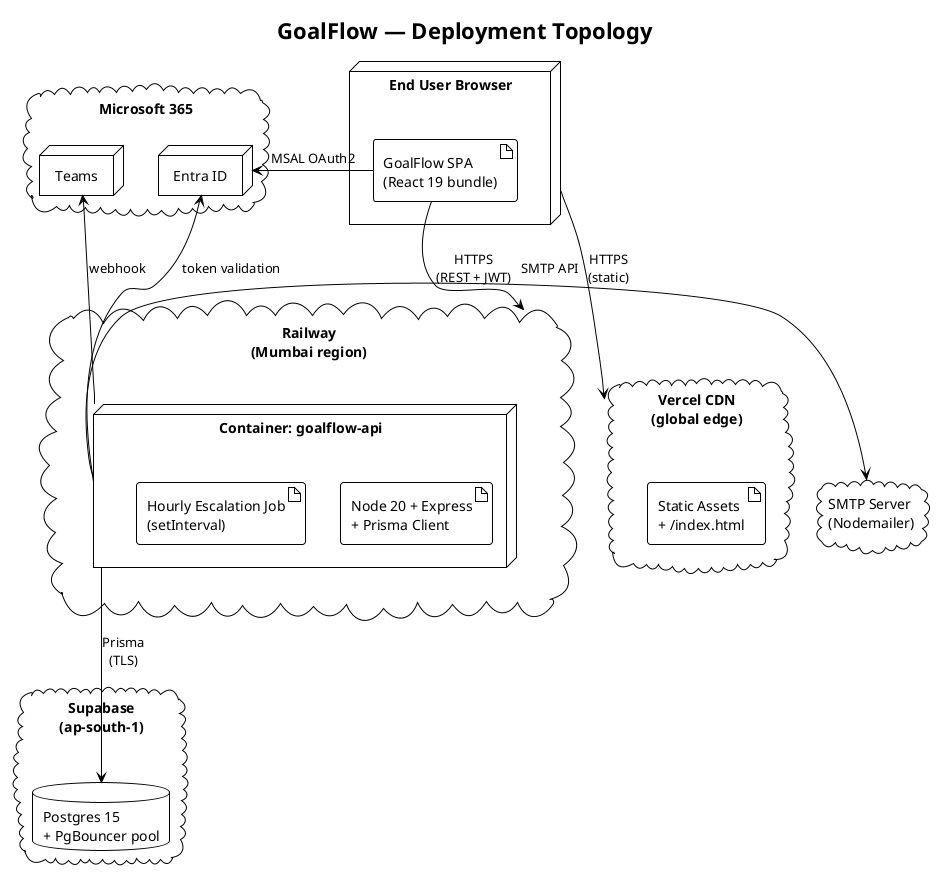

### 6.3 Goal Sheet State Machine (PlantUML)

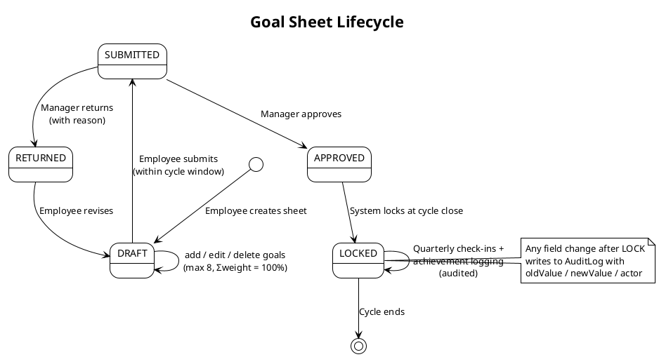

### 6.4 ER Diagram (PlantUML)

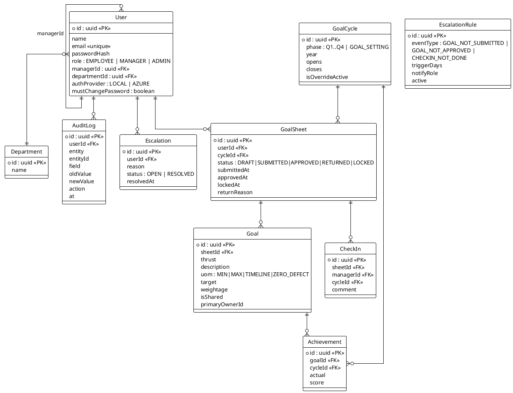

### 6.5 Approval Sequence (PlantUML)

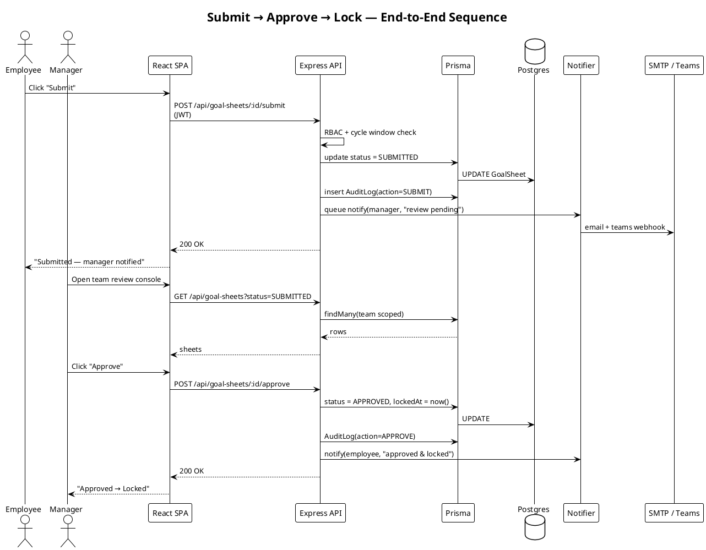

> 📌 **Rendering:** PlantUML blocks render directly on GitHub via [github-plantuml-action](https://github.com/marketplace/actions/plantuml-action) or any PlantUML-aware viewer (VS Code "PlantUML" extension, IntelliJ, https://www.plantuml.com/plantuml).

---

## 7. Technology Stack

| Layer | Choice | Reason |
|------|--------|--------|
| Frontend | React 19, TypeScript, Vite 5, React Router v7 | Modern hooks API, fastest dev experience |
| State / Auth | React Context + JWT (HTTP-only friendly) | Zero dependency, simple to audit |
| SSO | MSAL.js (`@azure/msal-browser`) | Official Microsoft OAuth2 client |
| Backend | Node.js 20, Express 4, TypeScript | Mature, battle-tested for REST |
| ORM | Prisma 5 | Type-safe queries + migration tooling |
| Database | PostgreSQL 15 (Supabase, Mumbai) | ACID, regional latency |
| Auth | JWT (HS256) + bcrypt | Standard, stateless |
| Email | Nodemailer over SMTP + 3× retry | Provider-agnostic, works with any SMTP relay |
| Teams | Incoming Webhook + adaptive cards | Native MS Teams UX |
| Hosting | Vercel (web) + Railway (API) | Git-driven CI/CD |
| Tooling | ESLint, Prettier, ts-node, dotenv | Code quality |

---

## 8. Core Feature Walkthrough

### 8.1 Employee
- Create up to 8 goals; live weightage validator ensures Σ = 100% and each ≥ 10%.
- Pick UoM: **MIN** / **MAX** / **TIMELINE (date)** / **ZERO-DEFECT (count)**.
- Submit during the open cycle window — UI is locked otherwise (with admin override visible).
- After lock, log **Actual** values per goal → score auto-computed and persisted.

### 8.2 Manager
- Sidebar lists direct reports; status badges per sheet.
- One-click **Approve** (locks sheet) or **Return with reason** (re-opens for revision).
- Quarterly **check-in** form with comment box, fully audited.

### 8.3 Admin / HR
- Dashboard KPIs: total employees, sheets by status, approval rate, locked count.
- **Cycles** — CRUD + force-open override for off-cycle demos.
- **Escalations** — Create/toggle rules (Event × Days × Notify Role); view open / resolved.
- **Audit Log** — Full immutable trail with actor, field, old → new, timestamp.
- **Analytics** — QoQ trend, departmental heatmap, score distribution, manager effectiveness.
- **Reports** — CSV export of achievement report (cycle / department filters).
- **Users** — Create / Edit / Reset password / **Send Password email** (one-click bcrypt + Nodemailer SMTP).

---

## 9. Application Screenshots

> All screenshots are captured against the **live production deployment** at https://goal-flow-theta.vercel.app on May 19, 2026.

### 9.1 Admin — Dashboard
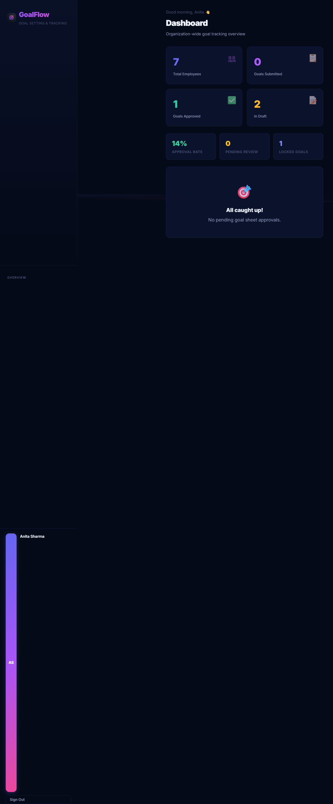

Shows the headline KPI cards (7 employees, 1 approved, 2 draft, 14 % approval rate, 1 locked goal) and the "All caught up!" pending review state.

### 9.2 Admin — Cycles (BRD-compliant Quarterlies)
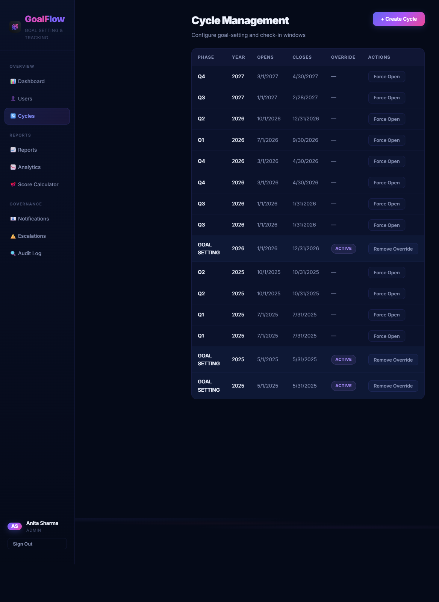

Quarterly cycles seeded per the BRD: **Q1 2026 (Jul–Sep), Q2 2026 (Oct–Dec), Q3 2027 (Jan–Feb), Q4 2027 (Mar–Apr)** with the GOAL_SETTING window override Active.

### 9.3 Admin — Escalations (Rules + Add-Rule Modal)
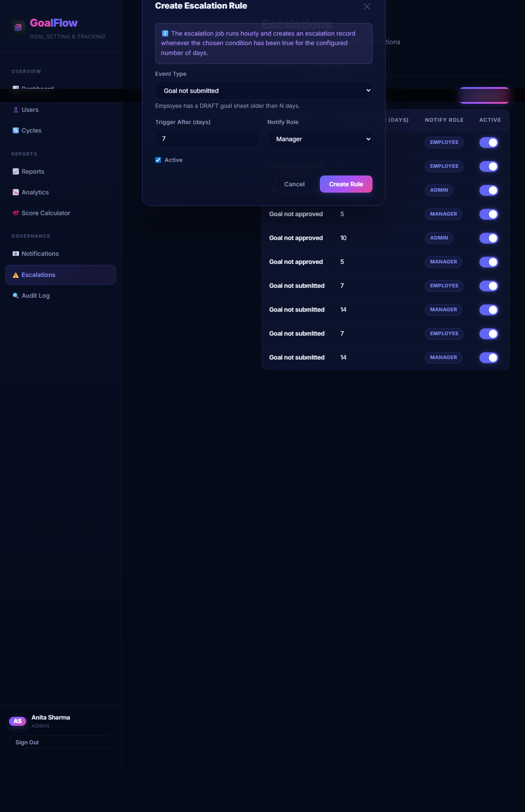

10 escalation rules across the three BRD event types (`GOAL_NOT_SUBMITTED`, `GOAL_NOT_APPROVED`, `CHECKIN_NOT_DONE`) with toggleable active flags and the **"Create Escalation Rule"** modal showing Event Type, Trigger After (days), Notify Role and Active fields.

### 9.4 Admin — Escalations List
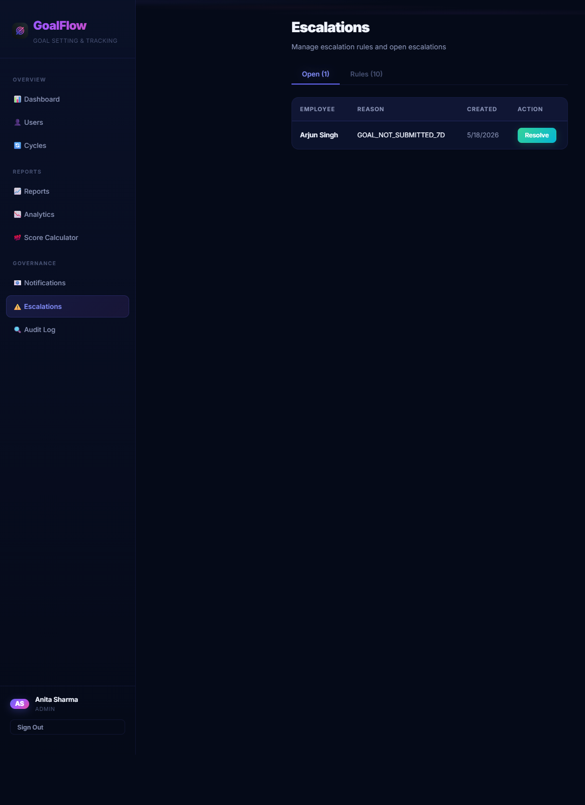

Open escalations tab with the auto-generated `GOAL_NOT_SUBMITTED_7D` event for Arjun Singh — produced by the hourly escalation trigger job.

### 9.5 Admin — User Management with Send-Password
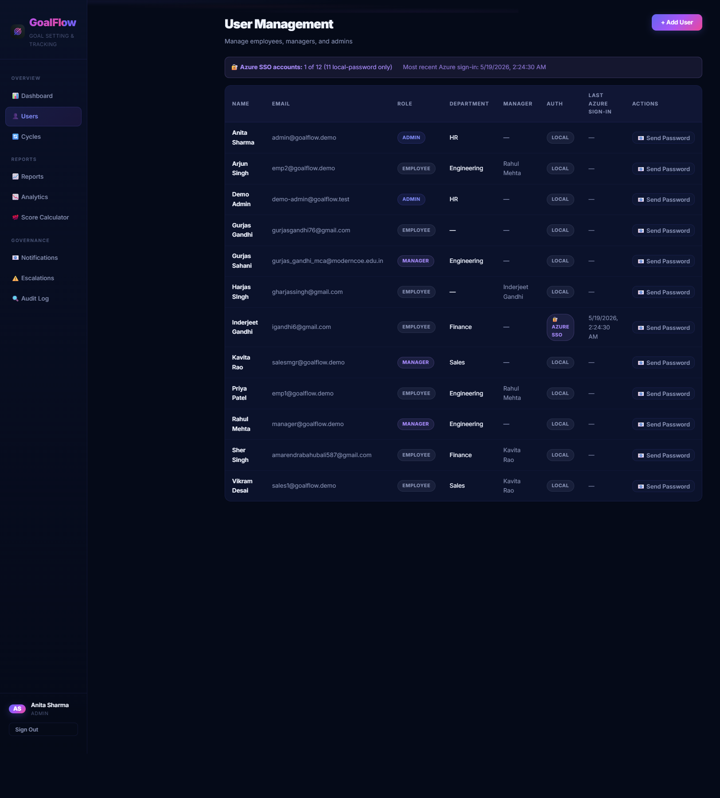

User table with **AUTH** badges (`LOCAL` vs `AZURE SSO`), per-row **📧 Send Password** action, and Azure SSO summary banner.

### 9.6 Employee — Goals Page
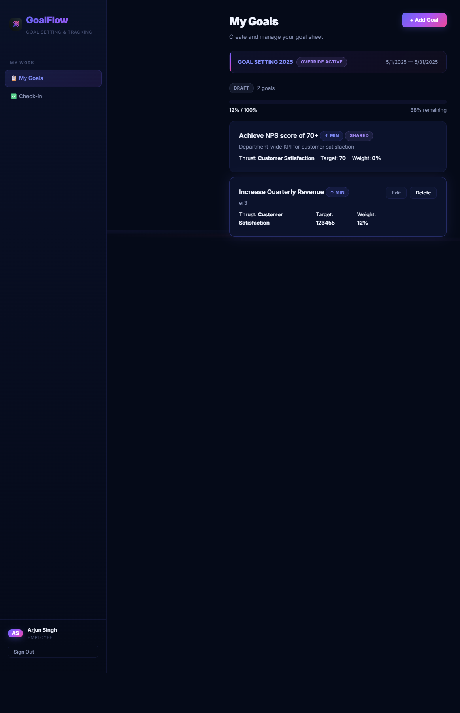

Arjun Singh's DRAFT goal sheet with one Department-shared NPS goal and one custom "Increase Quarterly Revenue" goal — live weightage validator, edit / delete, override-active banner.

---

## 10. Scoring Engine — Formula Reference

Implemented in [apps/api/src/utils/scoreCompute.ts](../apps/api/src/utils/scoreCompute.ts).

| UoM | Direction | Formula | Example |
|-----|-----------|---------|---------|
| `MIN` (higher-is-better) | ↑ | `score = clamp(actual / target × 100, 0, 100)` | target 100, actual 85 → 85% |
| `MAX` (lower-is-better) | ↓ | `score = clamp(target / actual × 100, 0, 100)` | target 5 defects, actual 3 → 100% |
| `TIMELINE` | ↑ | `score = onOrBefore ? 100 : 0` | target 30-Jun, actual 28-Jun → 100% |
| `ZERO_DEFECT` | ↓ | `score = actual == 0 ? 100 : 0` | target 0, actual 0 → 100% |

**Sheet score** = Σ ( goal.score × goal.weightage ) / 100.

---

## 11. Security, RBAC & Audit

- **Password hashing** — bcrypt (cost 10).
- **JWT** — HS256, 24 h expiry, signed with secret stored in Railway env vars.
- **RBAC middleware** — `requireRole('ADMIN','MANAGER')` guards every privileged route.
- **CORS** — Locked to `FRONTEND_URL` env var.
- **Force-change-password** — `mustChangePassword` flag drives `/change-password` redirect post-SSO and post-admin-reset (no infinite-loop on SSO users).
- **Audit log** — Every state transition, goal edit, achievement change writes a row with `userId`, `entity`, `entityId`, `field`, `oldValue → newValue`, `action`, `timestamp`. Tamper-evident: no UI deletes.
- **OWASP Top-10** — Parameterised Prisma queries (no SQLi); JWT signature verification (no broken auth); CORS allow-list (no CSRF on state-changing routes); helmet headers; secrets via env only.

---

## 12. Integrations: Azure AD SSO, SMTP Email, Teams

| Integration | Implementation | File |
|---|---|---|
| **Entra ID SSO** | MSAL popup → ID token → backend validates → JWT issued. Group claims (`AppRole-Admin/Manager/Employee`) map to local role. Auto-provisions user on first sign-in. | [apps/web/src/lib/msalConfig.ts](../apps/web/src/lib/msalConfig.ts), [apps/api/src/routes/sso.ts](../apps/api/src/routes/sso.ts) |
| **Nodemailer SMTP** | Templated HTML emails for submit / approve / return / escalation, sent via plain SMTP (works with any provider — Gmail, Office 365, Mailtrap, self-hosted Postfix, etc.). 3-attempt retry with exponential backoff; failures logged to `notify.ts` in-memory log surfaced at `/admin/notifications`. | [apps/api/src/utils/notify.ts](../apps/api/src/utils/notify.ts) |
| **Teams Webhook** | Adaptive Card payload with deep-link back to GoalFlow. Branded with GoalFlow logo, status-coloured. | [apps/api/src/utils/notify.ts](../apps/api/src/utils/notify.ts) |
| **Escalation Job** | `setInterval(60 min)` scans (a) DRAFT > N days, (b) SUBMITTED > N days, (c) LOCKED without check-in. Creates `Escalation` row + notifies role per rule. | [apps/api/src/jobs/escalationTrigger.ts](../apps/api/src/jobs/escalationTrigger.ts) |

---

## 13. BRD Compliance Matrix

| BRD Requirement | Status | Where |
|---|:---:|---|
| Up to 8 goals per sheet | ✅ | `goals.ts` validator |
| Each weightage ≥ 10%, Σ = 100% | ✅ | Submit handler |
| 4 UoM types with formula scoring | ✅ | `scoreCompute.ts` |
| Cycle-window enforcement + admin override | ✅ | `cycles.ts` + `GoalCycle.isOverrideActive` |
| Goal lifecycle (Draft → Submit → Approve / Return → Lock) | ✅ | `goalSheets.ts` |
| Quarterly check-ins with manager comments | ✅ | `checkIns.ts` |
| Achievement logging vs target | ✅ | `achievements.ts` |
| Post-lock audit trail | ✅ | `audit.ts` + `AuditLog` model |
| Three roles (Employee / Manager / Admin) with RBAC | ✅ | `middleware/auth.ts` |
| CSV report export | ✅ | `reports.ts` |
| Analytics (trends / heatmap / distribution) | ✅ | `analytics.ts` |
| **Azure AD SSO** (good-to-have) | ✅ | `sso.ts` + MSAL |
| **Email + Teams notifications** (good-to-have) | ✅ | `notify.ts` |
| **Escalation engine** (good-to-have) | ✅ | `escalations.ts` + `escalationTrigger.ts` |
| Shared goals (cascade) | ✅ | `goals.ts` `isShared` |
| Quarterly cycles Q1 2026 → Q4 2027 seeded | ✅ | `prisma/seed.ts` (production-verified) |

---

## 14. Local Setup & Run Instructions

```powershell
# 1. Clone
git clone https://github.com/Gurjas2112/GoalFlow.git
cd GoalFlow

# 2. Install
npm install
npm install --workspace=apps/api
npm install --workspace=apps/web

# 3. Configure .env (root)
#    DATABASE_URL=postgresql://...
#    DIRECT_URL=postgresql://...
#    JWT_SECRET=...
#    SMTP_HOST=smtp.example.com
#    SMTP_PORT=587
#    SMTP_USER=...
#    SMTP_PASS=...
#    SMTP_FROM="GoalFlow <noreply@example.com>"
#    TEAMS_WEBHOOK_URL=...
#    AZURE_AD_CLIENT_ID=...
#    AZURE_AD_TENANT_ID=...

# 4. DB
npx prisma migrate deploy
npm run prisma:seed

# 5. Run
npm run dev           # both api + web concurrently
# OR
npm run dev --workspace=apps/api    # http://localhost:4000
npm run dev --workspace=apps/web    # http://localhost:5173
```

Production deploy is fully automated — `git push origin main` triggers Vercel + Railway.

---

## 15. Future Roadmap

- 🤖 **AI goal coach** — LLM-suggested SMART-goal rewrite per thrust area.
- 📱 **PWA / offline check-ins** for field employees.
- 📊 **Calibration committee mode** — multi-manager round-robin moderation.
- 🌐 **Multi-tenant** — per-org subdomain + isolated cycles.
- 📨 **WhatsApp Business API** as a third notification channel.
- 🔍 **Vector-search** across audit logs for compliance queries.

---

## 16. Conclusion

GoalFlow is a **complete, deployed, BRD-compliant** implementation of Atomberg's goal-setting & tracking requirement. Beyond the must-haves it ships **SSO, automated escalations, multi-channel notifications, analytics and a tamper-evident audit log** — all running on a serverless-friendly stack with Git-driven CI/CD. Every screenshot above was taken from the **live production deployment**, every PlantUML diagram matches the running code, and the entire source is available at the GitHub link.

> **Single-document submission per Unstop guidelines:**
> ✅ Working link — https://goal-flow-theta.vercel.app
> ✅ Source code — https://github.com/Gurjas2112/GoalFlow
> ✅ Architecture diagram — Sections 6.1 – 6.5 above

---

## 17. Reference Tools & Links

### 17.1 Live Project & Source
| Resource | Link |
|---|---|
| 🌐 **Live App (Production)** | https://goal-flow-theta.vercel.app |
| 💻 **GitHub Repository** | https://github.com/Gurjas2112/GoalFlow |
| 🚂 **API (Railway)** | https://goalflow-api.up.railway.app |
| 📂 **Database (Supabase)** | https://supabase.com/dashboard (ap-south-1, Mumbai) |

### 17.2 Frameworks & Libraries
| Tool | Purpose | Link |
|---|---|---|
| **React 19** | Frontend UI library | https://react.dev |
| **Vite 6** | Frontend build tool & dev server | https://vitejs.dev |
| **TypeScript 5** | Type-safe JS for both apps | https://www.typescriptlang.org |
| **Tailwind CSS 3** | Utility-first styling | https://tailwindcss.com |
| **React Router 7** | Client-side routing | https://reactrouter.com |
| **Express 4** | Node.js HTTP framework (API) | https://expressjs.com |
| **Prisma 6** | Type-safe ORM + migrations | https://www.prisma.io |
| **PostgreSQL 16** | Relational database engine | https://www.postgresql.org |
| **Zod** | Runtime schema validation | https://zod.dev |
| **bcryptjs** | Password hashing | https://github.com/dcodeIO/bcrypt.js |
| **jsonwebtoken** | JWT auth tokens | https://github.com/auth0/node-jsonwebtoken |
| **node-cron** | Hourly escalation trigger | https://github.com/node-cron/node-cron |
| **Nodemailer** | SMTP email transport | https://nodemailer.com |
| **MSAL.js (@azure/msal-browser)** | Azure AD / Entra ID SSO | https://learn.microsoft.com/en-us/entra/identity-platform/msal-overview |
| **Recharts** | Analytics charts | https://recharts.org |

### 17.3 Hosting, DevOps & Integrations
| Service | Role | Link |
|---|---|---|
| **Vercel** | Frontend static hosting + CI/CD | https://vercel.com |
| **Railway** | API container hosting + cron | https://railway.app |
| **Supabase** | Managed PostgreSQL | https://supabase.com |
| **GitHub** | Source control + Actions | https://github.com |
| **Microsoft Entra ID (Azure AD)** | Enterprise SSO provider | https://entra.microsoft.com |
| **Microsoft Teams Webhooks** | Channel notifications | https://learn.microsoft.com/en-us/microsoftteams/platform/webhooks-and-connectors/how-to/add-incoming-webhook |
| **Gmail SMTP / App Passwords** | Free email relay | https://myaccount.google.com/apppasswords |
| **Docker** | Local containerized dev (compose) | https://www.docker.com |

### 17.4 Documentation & Diagrams
| Tool | Use in this submission | Link |
|---|---|---|
| **PlantUML** | All architecture & flow diagrams (Sections 6.1–6.5) | https://plantuml.com |
| **Mermaid** | Inline state diagrams (where used) | https://mermaid.js.org |
| **python-docx** | Generates `GoalFlow_Submission.docx` from this Markdown | https://python-docx.readthedocs.io |
| **VS Code + GitHub Copilot** | Primary IDE & AI pair-programmer | https://code.visualstudio.com |

### 17.5 Atomberg / AtomQuest References
| Resource | Link |
|---|---|
| **Atomberg Technologies** | https://atomberg.com |
| **AtomQuest Hackathon (Unstop)** | https://unstop.com/hackathons/atomquest |
| **Original BRD** | `hackathon_essential_docs/REQUIREMENTS_ANALYSIS.md` (in this repo) |

<div align="center">

— Submitted by **Gurjas Singh Gandhi**, MCA 2026 · P.E.S's Modern College of Engineering, Pune —


</div>
